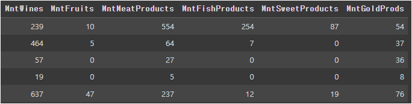

## **Successful E-Commerce Marketing**
 

#### 파일 설명
    Marketing_Analysis : 데이터 분석 진행 파일
    requirements : 작업에 사용된 라이브러리 버전 모음
    images : README 첨부 사진
 

### **사용한 데이터**
https://www.kaggle.com/datasets/jackdaoud/marketing-data 
다방면의 제품을 판매하는 E-Commerce 플랫폼 내 2년간 수집된 
마케팅·고객정보를 28개 특징으로 세분화한 데이터셋
  
Data preview 
1. Customer columns

   >   
       * ID - 고객 고유번호
       * Year_Birth - 고객의 출생년도
       * Education - 고객의 교육 수준
         (Graduation, Master, PhD, 2n Cycle, Basic)
       * Marital status - 고객의 결혼 상태
         (Married, Single, Widow, Divorce, Together,
          Alone, YOLO, Absurd)
       * Income - 고객의 연간 가구 소득
       * Kidhome - 고객 가정의 미취학아동 수
       * Teenhome - 고객 가정의 청소년 수
       * Dt_Customer - 고객 등록일
       * Recency - 마지막 구매 이후의 일수
       * Country - 고객의 국적
         (SA, CA, SP, GER, IND, US, AUS)
       * Complain - 고객의 불만 제기여부

2. Product columns

   >   
       * MntWines - 2년간 와인에 지출한 금액
       * MntFruits - 2년간 과일에 지출한 금액
       * MntMeatProducts - 2년간 육류 제품에 지출한 금액
       * MntFishProducts - 2년간 생선 제품에 지출한 금액
       * MntSweetProducts - 2년간 스낵류에 지출한 금액
       * MntGoldProds - 2년간 금 제품에 지출한 금액

3. Place columns

   >   
       * NumWebPurchases - 웹 사이트를 통해 구매한 횟수
       * NumCatalogPurchases - 카탈로그를 통한 구매 횟수 
       * NumStorePurchases - 매장에서 구매한 횟수
       * NumWebVisitsMonth - 웹 사이트 방문 횟수
       * NumDealsPurchases - 할인을 적용하여 구매한 횟수
4. Campaign(marketing) columns

   >   
       0 = 거부·무응답 / 1 = 수락
       * AcceptedCmp1 - 고객의 1번째 캠페인 수락 여부 
       * AcceptedCmp2 - 고객의 2번째 캠페인 수락 여부 
       * AcceptedCmp3 - 고객의 3번째 캠페인 수락 여부 
       * AcceptedCmp4 - 고객의 4번째 캠페인 수락 여부 
       * AcceptedCmp5 - 고객의 5번째 캠페인 수락 여부 
       * Response - 고객의 마지막 캠페인 수락 여부 
  
 

### **분석 목표**
플랫폼에서 진행한 다섯개 캠페인의 응답률, 제품별 매출 등 사업현황을 
인지하고, 고객의 소비패턴 등을 탐색하여 고객별 적합한 캠페인 전략을 제안 및 설계
  

### **분석 진행 방향**
**1. 데이터 전처리** 
　- 1.1 특성공학 
　- 1.2 고객 특성 
　- 1.3 상품 특성 
　- 1.4 구매방법 특성  

**2. 상관관계 분석 **
　- 2.1 고객의 소득에 대하여 
　- 2.2 양육가정의 소비 패턴에 대하여 
　- 2.3 마케팅 응답률에 대하여 
　- 2.4 웹 방문횟수에 대하여 

**3. 통계적 분석(사업현황) **
　- 3.1 상품별 매출 비중 
　- 3.2 소득수준별 고객 분포와 매출 
　- 3.3 캠페인(마케팅) 응답률 
　- 3.4 캠페인과 상품별 매출의 관계 

**4. 통계적 분석(고객현황) **
　- 4.1 소득수준별 소비 습관 
　- 4.2 소득수준별 마케팅 응답률 

**5. 결론 도출**  

### **1. 탐색적 데이터 분석 **

 

#### **1.1　특성공학**
> 항목별 합산 특성 생성  
> **1) 양육중인 아이** 
 
**미취학아동 + 청소년을 합산한 child 특성 생성**   
> **2) 총 상품 구매 금액** 
 
**주류, 신선제품, 스낵류, 금 구매 총액 특성 생성**  
> **3) 총 구매 횟수** 
 
**구매 방법별 횟수를 합산한 총 구매횟수 특성 생성**  
> **4) 총 마케팅 응답횟수** 
 
**마케팅별 응답 횟수를 합산하여 총 마케팅 응답횟수 특성 생성**
 

 

#### **1.2　고객 특성**
> 소득수준과 나이에서 이상치 제거
 

**- 소득수준이 6억이상인 고객의 경우 이상치로 판단하여 제거** 
**- 120세를 넘어가는 고객의 경우 오기입 또는 향후 고객으로 보기**  　**제한되어 이상치로 판단 후 제거**
 

 

#### **1.3　상품 특성**
> 육류제품과 스낵류에서 월등히 높은 소비(이상치) 제거

 

 

#### **1.4　구매방법 특성**
> 웹 구매 횟수에서 월등히 높은 소비(이상치) 제거

 

 

### **2. 상관관계 분석 **
> 전체 특성간 상관관계 양상을 확인 후 구체적 분석
 

 

>**Insight**
> 1. 소득(Income)은 지출금액(Mnt)항목, 대부분의  구매횟수(Num)와 양의 상관관계이다.  
> 2. 양육하는 아이의 수(Child)는 지출금액(Mnt)항목, 
구매횟수(Num)와 음의 상관관계이다.  
> 3. 1,2번 사례와 반대로, 할인율을 적용하여 구매한 횟수
(Num Deals Purchases)는 자녀수(Child)와 양의상관관계, 소득(Income)과 음의상관관계이다.  
> 4. 전체적 마케팅 응답사례(Tot_Campaign)는 소득(Income)과 약한 양의 상관관계였으나, 양육하는 아이(Child)와는 
약한 부정적상관관계이다.  
> 5. 한달 웹 방문횟수(NumWebVisitsMonth)와 웹에서 실제로 구매한 횟수(NumWebPurchases)는 상관이 없다.  
> 6. 한달 웹 방문횟수(NumWebVisitsMonth)와 할인율을  
적용하여 구매가 이뤄진 횟수(NumDeals Purchases)는 
양의 상관관계이다.

 

#### **2.1 고객의 소득에 대하여**
> 고객의 소득에 따라 소비활동 양상이 달라지는가?
 
**- 고객의 소득이 높을수록 총 판매량과 총 구매횟수가 증가** 　
(소득이 높아질수록 적극적인 소비활동)
 

 

#### **2.2 양육가정의 소비 패턴에 대하여**
> 양육중인 아이가 많을수록 소비활동 양상이 달라지는가?
 
**- 양육중인 아이가 많을수록 총 판매량, 총 구매횟수가 감소하나,** 　
**할인율을 적용해 구매한 횟수는 증가** 　
(아이를 양육할 경우 소비활동에 제약)
 

 

#### **2.3 마케팅 응답률에 대하여**
> 소비활동과 직관되는 마케팅 응답률이 
고객의 소득 / 양육중인 아이의 수에 달라지는가?
>  
**- 고객의 소득이 높을수록 마케팅 응답률 증가** 　
(소득이 높아질수록 적극적인 소비활동) 
**- 양육중인 아이의 수가 많을 수록 마케팅 응답률 감소** 　
(아이가 많을수록 소극적 소비활동)
 

 

#### **2.4 웹 방문횟수에 대하여**
> 웹 방문 횟수와 구매 횟수는 어떠한 관계이며, 
웹 방문 횟수와 할인상품 구매의 관계는 어떠한가?
 
**- 웹 방문 횟수와 구매 횟수간의 상관관계는 미식별** 
**- 웹 방문 횟수와 할인상품 구매 간 양의 상관관계 식별** 
(할인제품을 찾기 위해 주기적인 웹 방문이 이뤄질 것이라 추측)
 
 
2.2 분석에서 아이를 양육중인 고객은 소극적인 소비양상을 보였으나 할인제품 소비 횟수 만큼은 증가 하였는데 
할인상품 구매와 양의 상관관계에 있는 웹 방문 횟수도 증가하였는가?
 
**- 양육중인 아이가 많을수록 웹 방문 횟수도 증가했다.** 
(아이를 양육중인 고객은 할인제품 구매횟수가 증가하고,  이와 양의 상관관계에 있는 웹 방문횟수도 증가 하였기에,  웹을 통해 할인제품을 홍보·구매할 수 있음을 추측)
 

 

### **3. 통계적 분석(사업현황) **
플랫폼 내 매출과 직관된 자료 확인
 

 

#### **3.1 상품별 매출 비중**
> 플랫폼 내 상품별 매출 비중 확인
 
**- 주류와 육류가 합산 77.7%를 차지**
 

 

#### **3.2 소득수준별 고객 분포와 매출**
> 플랫폼 내 소득수준별 고객 분포 확인
 
**- 전체고객 중 저~중소득층(20K_Under ~ 60K)고객이 62.4%이나,** 　
**37.6%의 고소득층(60K~80K_Over)에서 매출의 75.1% 발생** 　
(전체 고객의 비중은 저~중소득층 비중이 높으나,  　매출부문 비중은 고소득층이 차지) 
　**소득수준별 고객분포와 매출이 비선형적**
 

 

#### **3.3 캠페인(마케팅) 응답률**
> 시행된 캠페인의 응답률 확인
 
**- 캠페인 2의 응답률이 1%대, 타 캠페인 응답률이 7%내외**
 

 

#### **3.4 캠페인과 상품별 매출의 관계**
> 캠페인과 상품별 매출 관계 확인
 
**- 캠페인 1 : 와인 20% / 육류 15% / 생선 10%** 
**- 캠페인 2 : 와인 8%** 
**- 캠페인 3 : 금 10% / 와인 5%** 
**- 캠페인 4 : 와인 40%** 
**- 캠페인 5 : 와인 30% / 육류 20% / 스낵 7%**  
캠페인에 따라 특정 상품군의 매출이 증대하는것으로 보아, 상품별로 특화된 캠페인이 있을 것이라 추측
 

 

### **4. 통계적 분석(고객현황) **
고객의 소비습관 확인
 

#### **4.1 소득수준별 소비 습관**
> 소득수준에 따른 소비 비중
 
**- 구매 액수의 차이일뿐, 상품별 매출비중처럼 Wine과 Meat에** 　
**소비가 집중** 　
(소득수준이 다르더라도 소비 양상이 비슷하여 소득에 따른 　 소비트렌드 해석 난해)
 

 

#### **4.2 소득수준별 캠페인(마케팅) 응답횟수**
> 소득수준에 따라 시행된 캠페인별 응답횟수
 
**- $20K미만 : Cmp3** 
**- $20K~40K : Cmp3** 
**- $40K~60K : Cmp4, Cmp3** 
**- $60K~80K : Cmp4, Cmp1, Cmp5, Cmp3** 
**- $80K초과 : Cmp5, Cmp1, Cmp4**  
－ Cmp2는 응답률이 낮았기에, 소득수준과 상관없이 매우 낮은 응답률을 기록 
－소득수준이 올라갈수록 전체적인 캠페인 참여 횟수가 증대 　(소득이 높아질수록 적극적인 소비활동) 
－소득수준이 올라갈수록 Cmp4, Cmp1, Cmp5 응답 횟수가 증가 　(Cmp4, Cmp1, Cmp5는 중~고소득분위에 걸맞는 캠페인이라 유추)
 

 

### **5. 결론 도출**
> **1. 매출의 77%가 와인과 육류로 이뤄지기 때문에 유통기한이 없는 과자와 금은 계속 판매할 수 있겠으나,** 
**신선제품인 과일, 생선류의 판매지속은 손해로 이어질 수 있으므로, 재고관리·판매중단을 권고**  
**2. 소득수준별 고객 분포와 매출이 비 선형적 관계임으로,** 
**탄탄한 고객인 저-중 소득층 고객의 유출을 방지하고,**
**매출을 확보해주는 고 소득층 고객을 유치하는 방향성 강구**  
**3. 소득수준과 관계없이 1%의 저조한 응답률을 기록한 Cmp2에 대하여 대대적 개편•파기 제안**  
**4. 저~중소득층 타깃 캠페인 :** 
연 소득 20K미만, 20K~40K, 40K~60K일때 Cmp3 응답률 향상 
해당 소득분위에 Cmp3 지속•집중시행.  
**5. 중 소득층 타깃 캠페인 :** 
연 소득 40K~60K, 60K~80K일때 Cmp4 응답률 향상 
해당 소득분위에 Cmp4 지속•집중시행.  
**6. 고 소득층 타깃 캠페인 :** 
연 소득 60K~80K, 80K 초과 일때 Cmp1, Cmp5 응답률 향상 
해당 소득분위에 Cmp1, Cmp5 지속•집중시행.  
**7. 육아 가정 타깃 캠페인 :** 
양육중인 아이가 있을 경우 구매액수나 횟수에 대해선 소극적인 소비활동을 영위하나, 할인상품 소비엔 긍정적 반응. 
웹 접속 횟수와 할인상품 구매 횟수의 상관관계가 확인되었기에, 
할인상품에 대한 정보를 웹으로 받아본다는 추측 하,  
양육중인 아이가 있는 고객을 위해 웹에서 진행되는 할인행사를 홍보하는 캠페인 신설 제안.  

>**소득수준과 아이양육 여부에 따른 캠페인 전개도**
 
－전 소득분위에서 반응이 좋았던 Cmp3와 Cmp4를 전개하되, 고소득층에겐 Cmp1과 Cmp5를 전개 
－아이를 양육중인 고객의 구매를 독려하기 위해 신설 캠페인을 전개
